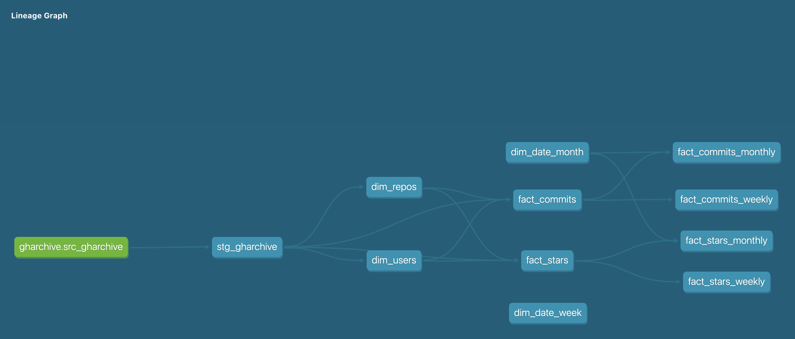

# GitHub Open Source ELT Pipeline

## Overview
In the rapidly evolving landscape of software development, open-source repositories on GitHub have become invaluable assets. They foster innovation and collaboration and serve as critical indicators for investors and companies looking to make informed decisions. Recognizing the importance of these repositories, this project aims to develop an ELT (Extract, Load, Transform) pipeline that provides insightful analysis of GitHub open-source repositories.

Using data from GH Archive (https://www.gharchive.org/), the project aims to identify and evaluate repositories based on key metrics such as popularity and contribution activities. By leveraging these metrics, users can identify repositories with the highest stars and significant commit histories, making well-informed decisions about their investments and contributions.

## Key Metrics Targeted
The primary objective of this ELT pipeline is to provide a comprehensive analysis of GitHub open-source repositories, offering valuable insights for investors and companies considering open-source investments. By focusing on key metrics, the pipeline enables users to make data-driven decisions based on the performance and health of various repositories.

- **Popularity Metrics:** Tracks the growth rate of repositories based on stars and forks to gauge overall popularity.
- **Contribution Metrics:** Assesses contributions through commit activities and pull request rates to understand developer involvement.

## Future work 
- **Influence Score:** A composite metric that integrates various signals such as stars, forks, and issues to evaluate the project's influence.
- **Developer Engagement Index:** Measures the frequency and recency of contributions, indicating active development and project health.
- **Issue Resolution Efficiency:** Analyzes how quickly issues are resolved, offering insights into the project's operational efficiency.
- **Dependency Risk Analysis:** Examines the number and reliability of project dependencies to assess stability risks.
- **Innovation Rate:** Monitors the introduction of new features and technologies, identifying projects that are at the forefront of innovation.
- **Funding and Sponsorship Activity:** Tracks sponsorship activities to gauge financial support and commercial interest in the project.

## Data Source
The ELT pipeline sources its data from GH Archive, a comprehensive repository of GitHub events. GH Archive records a wide array of events generated by GitHub repositories, such as stars, forks, commits, pull requests, and issues. This extensive dataset provides a rich foundation for analyzing the dynamics and health of open-source projects. The data loader function in the pipeline is designed to handle incremental loads, ensuring continuous updates with new events.

## Data Warehouse
DuckDB is used as the data warehouse for this project. DuckDB is an efficient, in-process SQL OLAP database management system, capable of handling complex queries and large datasets, making it an ideal choice for this ELT pipeline. DuckDB’s seamless integration with other tools and its powerful analytical capabilities ensure efficient data organization, storage, and retrieval.

## ELT Pipeline Overview
The core of this project is the ELT process, which extracts data from GH Archive, loads it into DuckDB, and then transforms it using DBT (Data Build Tool). This approach ensures efficient data processing and allows for comprehensive analysis.

## Tools and Technologies Used
- **GH Archive:** The primary data source, providing extensive GitHub event data.
- **duckDB:** An efficient, in-process SQL OLAP database used as the data warehouse.
- **DBT (Data Build Tool):** Utilized for the majority of the transformation work, leveraging features such as macros, incremental loading, tests, and Jinja templates.
- **Flask:** A lightweight WSGI web application framework used as the backend server to handle API requests and serve the data.
- **Streamlit:** A web application framework used to create an interactive and user-friendly interface for visualizing the data.

## Data Ingestion
The data ingestion process is a crucial step in the ELT pipeline, involving the extraction and loading of data from GH Archive into DuckDB. This is managed by the ExtractLoad class, which handles both initial and incremental data loads.

### ExtractLoad Class
The ExtractLoad class is designed to streamline the extraction and loading of JSON data from GH Archive. It performs the following steps:

- Unzipping JSON Files: It unzips .json.gz files from the source directory into a temporary directory.
- Counting Files: It counts the number of unzipped JSON files and logs this information.
- Creating Schema: It connects to DuckDB and creates the source schema if it doesn’t exist.
- Loading Data: It loads all JSON files into the source.src_gharchive table in DuckDB, adding a loaded_at timestamp to each record for future reference.

The incremental_load method manages the addition of new data since the last load by fetching the latest loaded_at timestamp and processing only new files.

## DBT Transform Code
Once the data is ingested and loaded into DuckDB, the next step is transforming it into a structured format that supports insightful analysis. This transformation is accomplished using the Kimball dimensional modeling approach, facilitated by DBT.

## Kimball Approach
The Kimball approach is a renowned methodology for designing data warehouses, focusing on making the data easy to understand and analyze. It revolves around two main types of tables: fact tables and dimension tables.

- Fact Tables: These tables store quantitative data, such as counts or amounts, which can be analyzed. They typically contain numerical measures and foreign keys to dimension tables.
- Dimension Tables: These tables store descriptive attributes related to the facts, providing context.

## Fact and Dimension Models

### Fact Tables
- fact_stars
	- event_id (Primary Key)
	- repo_id (Foreign Key to dim_repositories)
	- user_id (Foreign Key to dim_users)
	- event_date (Date)
- fact_commits
    - event_id (Primary Key)
    - repo_id (Foreign Key to dim_repositories)
    - user_id (Foreign Key to dim_users)
    - event_date (Date)

### Dimension Tables
- dim_repositories
	- repo_id (Primary Key)
	- repo_name (String)
	- owner_id (Foreign Key to dim_users)
- dim_users
	- user_id (Primary Key)
	- user_name (String)

## Setting Up the DBT Project
To create a new DBT project, follow these steps:
- Install DBT: pip install dbt
- Initialize the Project: dbt init my_project

This creates a directory structure with necessary configuration files. The profiles.yml file in the ~/.dbt/ directory defines the connection details for DBT to access DuckDB.

## Lineage Graph


## Backend Server and Visualization
To provide an interactive and user-friendly interface for exploring the transformed data, Flask is used as the backend server, and Streamlit is used for visualization.

### Flask Backend Server
Flask handles API requests and serves processed data, acting as a bridge between the data warehouse and the visualization layer.

## Streamlit Visualization
Streamlit is used to create interactive and dynamic visualizations, allowing users to explore and visualize the transformed data effortlessly.

## Dockerizing the Application
To streamline deployment and ensure consistency across different environments, the entire application is Dockerized. Docker containers encapsulate all dependencies and configurations needed to run the application, making it easy to deploy and scale. Docker Compose orchestrates the services, simplifying the management of the entire application stack.

## Getting Started
To start the project, follow these steps:
	
1.	Clone the Repository:
```bash
git clone <repository_url>
cd <repository_directory>
```
2.	Build and Start the Application:
```bash
docker-compose up --build
```

Once the Docker build process is complete, the Streamlit application will start running on its designated port. You can access the interactive dashboard via your web browser on port 8501.
